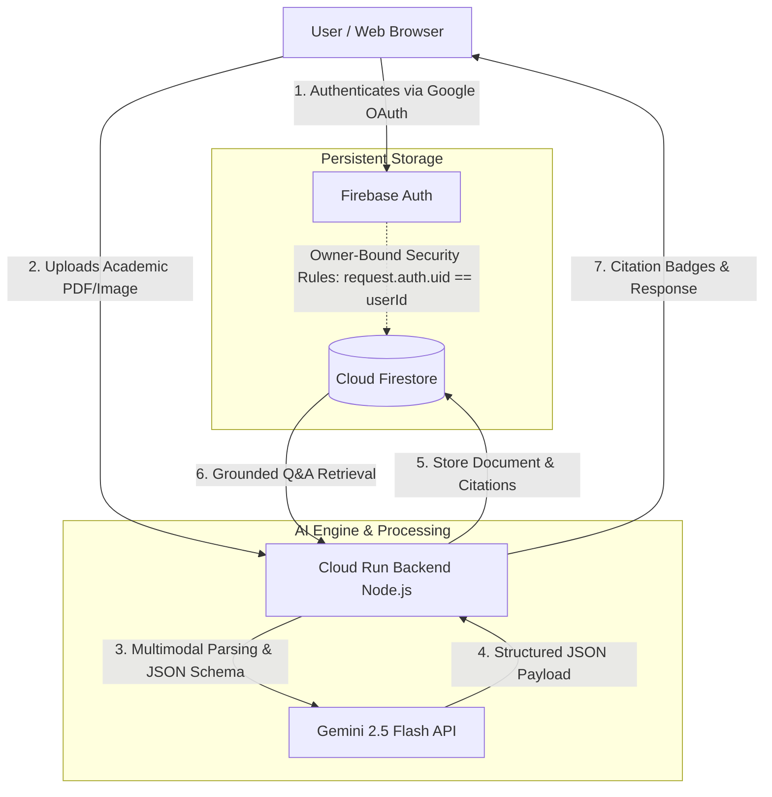

# Academic Vault AI: Secure Cloud Run Application

A secure, user-authenticated academic credential archive and reflective assistant built with **Gemini 3.6 Flash**, **Cloud Firestore**, and **Firebase Authentication**. Features structured multimodal document parsing (PDF/Images), structured JSON extraction, owner-bound Firestore security, and citation-grounded conversational chat.

---

## 📋 Product Requirements Summary (PRD)

### Problem
Students and professionals struggle to quickly find, verify, and query specific marks, GPA, and conferral dates across fragmented academic PDFs and image scans.

### Target Audience
- Students managing degree certificates and transcripts
- Academic advisors verifying credentials
- Job applicants consolidating multiple qualifications

### Core Value Proposition
Converts static academic documents into structured JSON data schemas and provides a private, citation-backed AI assistant for grounded Q&A.

### Key Features
1. **Federated Sign-In:** Secure Google OAuth via Firebase Authentication.
2. **Multimodal Parsing:** Instant extraction of GPA, major, institution, and honors using Gemini Flash.
3. **Verification Modal:** Interactive form allowing users to review and correct parsed JSON metadata before saving.
4. **Citation-Grounded Chat:** Conversational queries backed by explicit source citations.
5. **Data Privacy:** Owner-isolated Cloud Firestore database rules (`request.auth.uid == userId`).

---

## 🏗️ System Architecture



---

## 🚀 Live Application

- **Live Cloud Run URL:** [https://academic-vault-ai-1079059256760.us-central1.run.app/](https://academic-vault-ai-1079059256760.us-central1.run.app/)
- **Service Name:** `academic-vault-ai`
- **Verification Label:** `dev-tutorial: cloud-run-ai-challenge`

## 1. System Architecture & Threat Model

The application strictly implements defense-in-depth across the 5 Threat Zones:

| Threat Zone | Identified Risks | Implementation Countermeasures |
| :--- | :--- | :--- |
| **Input Surfaces** | Malformed prompts, oversized file uploads (PDF/images), injection attacks. | Strict 25MB body payload bounds, schema destructuring, MIME validation (`application/pdf`, `image/*`). |
| **Planning & Reasoning** | Indirect prompt injection via parsed document text or malicious file payloads. | Unstrusted text in marksheets/degrees treated as plain data. Gemini instructed to adhere to structured JSON output without injected instructions. |
| **Tool Execution & API** | Secret leakage, SSRF, quota exhaustion. | Server-side route isolation (`/api/gemini/extract-document`, `/api/gemini/reflect`, `//api/gemini/summarize`); `GEMINI_API_KEY` stored in Google Secret Manager, never logged. |
| **Memory & State** | Cross-user data leakage, session tampering. | Owner-bound Firestore security rules (`request.auth.uid == userId`) restricting all read/write operations to `/users/{userId}/interactions/` and `/users/{userId}/documents/`. Firebase Auth token server-side validation. |
| **Inter-System Communication** | Token interception, plain-text credential leaks. | Federated Google Sign-In via Firebase Auth (no password storage); Google Secret Manager runtime injection for API keys; HTTPS enforced on Cloud Run. |

---

## 2. Environment & Prerequisites

1. **Google Cloud SDK (`gcloud`)**:
   Ensure `gcloud` CLI is installed and authenticated:
   ```bash
   gcloud auth login
   gcloud config set project YOUR_PROJECT_ID
   ```

2. **Enable Required Google Cloud APIs**:
   ```bash
   gcloud services enable \
     run.googleapis.com \
     secretmanager.googleapis.com \
     firestore.googleapis.com \
     cloudbuild.googleapis.com \
     aiplatform.googleapis.com
   ```

---

## 3. Secret Management Setup (Google Secret Manager)

Store the Gemini API Key securely in Secret Manager and grant the Cloud Run compute service account access:

```bash
# Create and populate the secret
gcloud secrets create GEMINI_API_KEY --replication-policy="automatic"
echo -n "YOUR_API_KEY" | gcloud secrets versions add GEMINI_API_KEY --data-file=-

# Grant the default Cloud Run service account access to read the secret
PROJECT_NUMBER=$(gcloud projects describe YOUR_PROJECT_ID --format="value(projectNumber)")

gcloud secrets add-iam-policy-binding GEMINI_API_KEY \
  --member="serviceAccount:${PROJECT_NUMBER}-compute@developer.gserviceaccount.com" \
  --role="roles/secretmanager.secretAccessor"
```

---

## 4. Firestore Security Rules Configuration

All user data is isolated into subcollections under `/users/{userId}`:
- `/users/{userId}/interactions/{interactionId}`: Multi-turn reflection history and insights.
- `/users/{userId}/documents/{documentId}`: Verified academic credentials (degrees, marksheets, certificates).

Deploy the owner-bound security rules in `firestore.rules`:

```javascript
rules_version = '2';
service cloud.firestore {
  match /databases/{database}/documents {
    match /users/{userId}/interactions/{interactionId} {
      allow read, write: if request.auth != null && request.auth.uid == userId;
    }
    match /users/{userId}/documents/{documentId} {
      allow read, write: if request.auth != null && request.auth.uid == userId;
    }
  }
}
```

Deploy the rules via Firebase CLI:
```bash
firebase deploy --only firestore:rules
```

---

## 5. Google Cloud Run Deployment Flow

Build and deploy the application container to Cloud Run using the standard Google AI Studio Gemini API key setup (with `GOOGLE_GENAI_USE_VERTEXAI=false` and standard Gemini Flash models `gemini-2.5-flash`):

```bash
# Build and deploy service with Google AI Studio GEMINI_API_KEY
gcloud run deploy academic-vault-ai \
  --source . \
  --platform managed \
  --region us-central1 \
  --allow-unauthenticated \
  --port 3000 \
  --set-env-vars GOOGLE_GENAI_USE_VERTEXAI=false \
  --set-secrets GEMINI_API_KEY=GEMINI_API_KEY:latest
```

---

## 6. Required Campaign Verification Binding

Apply the mandatory verification resource label to register the Cloud Run service for automated challenge verification:

```bash
gcloud run services update academic-vault-ai \
  --update-labels=dev-tutorial=cloud-run-ai-challenge \
  --region=us-central1
```

---

## 7. Functional Stability & Walkthrough Steps

### Test Flow 1: Google Sign-In & Workspace Provisioning
1. Open the landing page. Verify clean Editorial typography and Google Sign-In prompt.
2. Click **"Sign in with Google"**. Complete authentication.
3. Verify immediate redirection to private workspace. Notice the **Firestore Synced** status indicator.

### Test Flow 2: Document Upload & Gemini Structured Extraction
1. Click the **Paperclip / Upload Document** button or drag-and-drop a marksheet or certificate (PDF, PNG, or JPEG).
2. Verify the extraction banner appears: *"Extracting structured academic metadata with Gemini 3.6 Flash..."*
3. Verify the **Review Extracted Credential** confirmation card appears before saving, displaying:
   - Document Classification (`Marksheet`, `Degree`, `Certificate`, `Other`)
   - Issuing Institution
   - Date of Issuance and Location
   - Academic Performance (GPA, Total Score, Honors)
   - Extracted Subjects and Grades table
   - Credential summary
4. Edit or add an additional subject row in the confirmation card.
5. Click **"Confirm & Save to Academic Vault"**.
6. Verify record is archived to Firestore `/users/{userId}/documents/{documentId}`.

### Test Flow 3: Academic Vault & Credential Inspection
1. Click the **Academic Vault** button in the header or sidebar.
2. Verify the vault modal displays all verified documents with search filtering by institution, subject, or credential type.
3. Click **"View Details"** on any credential card to inspect full grade breakdown and markdown citation syntax (`[Doc: ...](#doc:...)`).
4. Click **"Ask Gemini About This"** to formulate an inquiry directly into the reflection workspace.

### Test Flow 4: Grounded Multi-Turn Dialogue & Citation Links
1. Submit an academic question (e.g., *"What is my GPA and which courses did I excel in?"*).
2. Verify Gemini references your vault credentials and produces interactive markdown citations in the form `[Doc: Institution DocType](#doc:ID)`.
3. Click the interactive citation badge inside Gemini's response.
4. Verify the **Document Detail Modal** opens immediately displaying the exact underlying verified record.

### Test Flow 5: Summarization & Reflection Export
1. Click **"Summarize"** in the top toolbar.
2. Verify Gemini 3.6 Flash generates structured takeaways, sentiment analysis, and a recommended academic action.
3. Click the **Download** icon to export the complete multi-turn reflection session as Markdown (`.md`).
4. Sign out and log in with another account; verify complete data isolation.


## 🏆Ideathon Submission

Built for the **Google Cloud Run AI Challenge / Ideathon**, demonstrating full-stack serverless deployment, structured multimodal extraction with Gemini 3.6 Flash, and secure user-authenticated AI-driven academic credential management.

---

## 👩‍💻 Author

- **Name:** Krithika shree.K
- **GitHub:** [@krithikashree1957](https://github.com/krithikashree1957)
